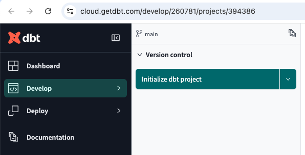
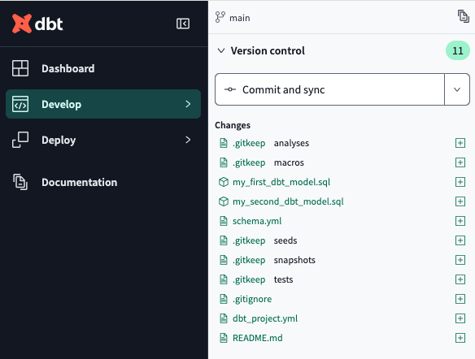
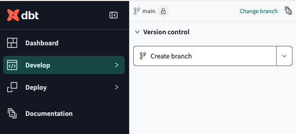
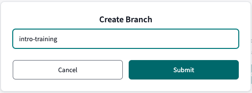

# dbt Essentials Guide
This is our step by step instructions for the TIL dbt essentials training

[Getting started with dbt Cloud](#getting-started-with-dbt-cloud)

[Testing & Debugging](#testing--debugging)

[Incremental Models](#incremental-models)


## Getting started with dbt Cloud

1. Click "Initialize dbt project" in version control

    

2. Click "Commit and sync" in version control and enter a commit message in the dialogue box

    

3. Click "Create branch" in version control and name it "intro-training"

    

    

4. In the command bar, run the command

    ```sh
    dbt run
    ```
    to create all models in our data warehouse

5. Make a new folder "models/lego"

6. Update dbt_project.yml lines 38-43 to materialise all models in the lego directory as tables by default

    ```yaml
    models:
      my_new_project:
        # Applies to all files under models/example/
        example:
          +materialized: table

        lego:
          +materialized: table
    ```

7. Create a new file within the legos directory called parts_per_set.sql ("/models/lego/parts_per_set.sql") and paste in the contents from Original Lego Script.txt

    ```sql
    WITH UNIQUE_PARTS AS (
    SELECT 
        P.part_num
    FROM dbt_course.lego.parts as P
    INNER JOIN dbt_course.lego.inventory_parts as IP on P.part_num = IP.part_num
    INNER JOIN dbt_course.lego.inventories as I on I.id = IP.inventory_id
    INNER JOIN dbt_course.lego.sets as S on S.set_num = I.set_num
        GROUP BY P.part_num
        HAVING COUNT(*) = 1
    )
    SELECT 
        T.name as theme_name,
        S.name as set_name,
        S.year as set_year,
        CASE 
            WHEN UP.part_num IS NULL THEN 'Not Unique' 
            ELSE 'Unique' 
        END as unique_part,
        COUNT(P.part_num) as parts
    FROM dbt_course.lego.parts as P
    LEFT JOIN UNIQUE_PARTS as UP on P.part_num = UP.part_num
    INNER JOIN dbt_course.lego.inventory_parts as IP on P.part_num = IP.part_num
    INNER JOIN dbt_course.lego.inventories as I on I.id = IP.inventory_id
    INNER JOIN dbt_course.lego.sets as S on S.set_num = I.set_num
    INNER JOIN dbt_course.lego.themes as T on T.id = S.theme_id
    GROUP BY 1,2,3,4;
    ```

8. In the command bar, run the command

    ```sh
    dbt run --select parts_per_set
    ```
    to create the parts_per_set model in our data warehouse

9. Remove the semicolon from line 26 in models/lego/parts_per_set.sql

    ```sql
    GROUP BY 1,2,3,4
    ```

10. In the command bar, run the command

    ```sh
    dbt run --select lego
    ```
    to create all models in the lego folder in our data warehouse

11. Create a new file within the lego directory called sources.yml ("/models/lego/sources.yml") directing dbt to where the source tables are.

    ```yaml
    version: 2
    
    sources:
      - name: lego
        database: dbt_course
        schema: lego
        tables:
          - name: parts
          - name: inventory_parts
          - name: inventories
          - name: sets
          - name: themes
    ```

12. Edit parts_per_set.sql to replace all hardcoded table names with the source function

    ```sql
    WITH UNIQUE_PARTS AS (
    SELECT 
        P.part_num
    FROM {{ source('lego', 'parts') }} as P
    INNER JOIN {{ source('lego', 'inventory_parts') }} as IP on P.part_num = IP.part_num
    INNER JOIN {{ source('lego', 'inventories') }} as I on I.id = IP.inventory_id
    INNER JOIN {{ source('lego', 'sets') }} as S on S.set_num = I.set_num
        GROUP BY P.part_num
        HAVING COUNT(*) = 1
    )
    SELECT 
        T.name as theme_name,
        S.name as set_name,
        S.year as set_year,
        CASE 
            WHEN UP.part_num IS NULL THEN 'Not Unique' 
            ELSE 'Unique' 
        END as unique_part,
        COUNT(P.part_num) as parts
    FROM {{ source('lego', 'parts') }} as P
    LEFT JOIN UNIQUE_PARTS as UP on P.part_num = UP.part_num
    INNER JOIN {{ source('lego', 'inventory_parts') }} as IP on P.part_num = IP.part_num
    INNER JOIN {{ source('lego', 'inventories') }} as I on I.id = IP.inventory_id
    INNER JOIN {{ source('lego', 'sets') }} as S on S.set_num = I.set_num
    INNER JOIN {{ source('lego', 'themes') }} as T on T.id = S.theme_id
    GROUP BY 1,2,3,4
    ```

13. Create a new file in the lego directory called unique_parts.sql ("/models/lego/unique_parts.sql")

14. Copy lines 2-9 from parts_per_set.sql into unique_parts.sql

    ```sql
    SELECT 
        P.part_num
    FROM {{ source('lego', 'parts') }} as P
    INNER JOIN {{ source('lego', 'inventory_parts') }} as IP on P.part_num = IP.part_num
    INNER JOIN {{ source('lego', 'inventories') }} as I on I.id = IP.inventory_id
    INNER JOIN {{ source('lego', 'sets') }} as S on S.set_num = I.set_num
        GROUP BY P.part_num
        HAVING COUNT(*) = 1
    ```

15. Add a config block to the top of unique_parts.sql to materialise it as a view in the data warehouse

    ```sql
    {{
        config(
            materialized='view'
        )
    }}

    SELECT 
        P.part_num
    FROM {{ source('lego', 'parts') }} as P
    INNER JOIN {{ source('lego', 'inventory_parts') }} as IP on P.part_num = IP.part_num
    INNER JOIN {{ source('lego', 'inventories') }} as I on I.id = IP.inventory_id
    INNER JOIN {{ source('lego', 'sets') }} as S on S.set_num = I.set_num
        GROUP BY P.part_num
        HAVING COUNT(*) = 1
    ```

16. Update parts_per_set.sql to replace the CTE (lines 1-10) with a ref() function aimed at unique_parts.sql

    ```sql
    WITH UNIQUE_PARTS AS (
        SELECT * 
        from {{ ref('unique_parts') }}
    )
    SELECT 
        T.name as theme_name,
        S.name as set_name,
        S.year as set_year,
        CASE 
            WHEN UP.part_num IS NULL THEN 'Not Unique' 
            ELSE 'Unique' 
        END as unique_part,
        COUNT(P.part_num) as parts
    FROM {{ source('lego', 'parts') }} as P
    LEFT JOIN UNIQUE_PARTS as UP on P.part_num = UP.part_num
    INNER JOIN {{ source('lego', 'inventory_parts') }} as IP on P.part_num = IP.part_num
    INNER JOIN {{ source('lego', 'inventories') }} as I on I.id = IP.inventory_id
    INNER JOIN {{ source('lego', 'sets') }} as S on S.set_num = I.set_num
    INNER JOIN {{ source('lego', 'themes') }} as T on T.id = S.theme_id
    GROUP BY 1,2,3,4
    ```

17. In the command bar, run the command

    ```sh
    dbt run --select lego
    ```
    to create the two lego models sequentially in the data warehouse

18. Create a new file within the lego directory called schema.yml ("/models/lego/schema.yml") to add in documentation and tests.

    ```yml
    version: 2
    
    models:
      - name: unique_parts
        description: The part_nums which are only used in one set
        columns:
          - name: part_num
            data_tests:
              - not_null
              
      - name: parts_per_set
        description: Shows the number of parts in each set along with their theme and whether they have unique parts
        columns:
          - name: theme_name
            data_tests:
              - not_null
          - name: set_name
            data_tests:
              - not_null
          - name: set_year
            data_tests:
              - not_null
    ```

19. In the command bar, run the command

    ```sh
    dbt build
    ```
    to create and test all models in our data warehouse

20. In the command bar, run the command

    ```sh
    dbt test
    ```
    to test all models

21. Edit the my_first_dbt_model.sql file in the example directory ("/models/example/my_first_dbt_model.sql") to remove the comment on line 27

    ```sql

    /*
        Welcome to your first dbt model!
        Did you know that you can also configure models directly within SQL files?
        This will override configurations stated in dbt_project.yml

        Try changing "table" to "view" below
    */

    {{ config(materialized='table') }}

    with source_data as (

        select 1 as id
        union all
        select null as id

    )

    select *
    from source_data

    /*
        Uncomment the line below to remove records with null `id` values
    */

    where id is not null

    ```

22. In the command bar, run the command

    ```sh
    dbt build
    ```
    to create and test all models in our data warehouse. All should pass.

23. Update the sources.yml file in the lego directory ("/models/lego/sources.yml") to paste in the completed version from the fileshare.

    ```yml
    version: 2
    
    sources:
      - name: lego
        database: DBT_COURSE
        schema: LEGO
        tables:
          - name: colors
            description: dimension table of lego colors
            columns:
              - name: id
                description: primary key and unique identifier of each color
                data_tests:
                  - not_null
                  - unique
              - name: name
                description: the name of the color
                data_tests:
                  - not_null
                  - unique
              - name: RGB
                description: the hex value of the color
                data_tests:
                  - not_null
              - name: is_trans
                data_tests:
                  - accepted_values:
                      values: ["TRUE", "FALSE"]
    
          - name: inventories
            description: dimension table of what we currently stock
            columns:
              - name: id
                description: primary key
                data_tests:
                  - unique
                  - not_null
              - name: version
                description: the version of each set we carry
                data_tests:
                  - not_null
              - name: set_num
                description: foreign key and the set identifier
                data_tests:
                  - not_null
                  - relationships:
                      to: source('lego','sets')
                      field: set_num
    
          - name: inventory_parts
            description: the parts within each set we stock
            columns:
              - name: inventory_id
                description: foreign key to inventories table
                data_tests:
                  - not_null
                  - relationships:
                      to: source('lego','inventories')
                      field: id
              - name: part_num
                description: foreign key to parts table - not behaving properly
                data_tests:
                  - not_null
              - name: color_id
                description: foreign key to colors table
                data_tests:
                  - not_null
                  - relationships:
                      to: source('lego','colors')
                      field: id
              - name: quantity
                description: how many of that part is in the set
                data_tests:
                  - not_null
              - name: is_spare
                description: boolean if the part is spare
                data_tests:
                  - not_null
                  - accepted_values:
                      values: ["TRUE", "FALSE"]
    
          - name: inventory_sets
            description: dimension table of sets and how many we stock
            columns:
              - name: inventory_id
                description: foreign key to inventories
                data_tests:
                  - not_null
                  - relationships:
                      to: source('lego','inventories')
                      field: id
              - name: set_num
                description: foreign key from sets
                data_tests:
                  - not_null
                  - relationships:
                      to: source('lego','sets')
                      field: set_num
              - name: quantity
                description: how many of each set we hold
    
          - name: parts
            description: dimension table of lego parts
            columns:
              - name: part_num
                description: primary key and unique identifier of each part
                data_tests:
                  - not_null
                  - unique
              - name: name
                description: the name of the part
                data_tests:
                  - not_null
              - name: part_cat_id
                description: foreign key from part_categories table
                data_tests:
                  - not_null
                  - relationships:
                      to: source('lego','part_categories')
                      field: id
    
          - name: part_categories
            description: dimension table combining parts into different categories
            columns:
              - name: id
                description: primary key
                data_tests:
                  - unique
                  - not_null
              - name: name
                description: the part category name
                data_tests:
                  - not_null
    
          - name: sets
            description: dimension table of all lego sets
            columns:
              - name: set_num
                description: primary key
                data_tests:
                  - not_null
                  - unique
              - name: name
                description: the name of the set
                data_tests:
                  - not_null
              - name: year
                description: the year the set was released
                data_tests:
                  - not_null
              - name: theme_id
                description: foreign key from themes
                data_tests:
                  - not_null
                  - relationships:
                      to: source('lego','themes')
                      field: id
              - name: num_parts
                description: the number of parts in each set
                data_tests:
                  - not_null
    
          - name: themes
            description: dimension table grouping sets into different themes
            columns:
              - name: id
                description: primary key
                data_tests:
                  - not_null
                  - unique
              - name: name
                description: the name of the theme
                data_tests:
                  - not_null
              - name: parent_id
                description: if a theme is a sub-theme, the id of its parent
                data_tests:
                  - relationships:
                      to: source('lego','themes')
                      field: id
    ```
    This completed version has full descriptions of sources and their columns. It also uses all 4 in-built data_tests (not_null, unique, accepted_values, relationships)

24. In the command bar, run the command

    ```sh
    dbt build
    ```
    to make and then test all our models sequentially in the data warehouse

25. In the command bar, run the command

    ```sh
    dbt docs generate
    ```
    to generate documentation based on the models and yaml files in our project

26. Click the little document icon to see the documentation

    

27. Click "Commit and sync" in version control and enter a commit message in the dialogue box

    

## Testing & Debugging

1. Make a new folder in the models directory called library_loans ("/models/library_loans")

2. In library_loans make a new file called customers_with_late_fees.sql ("/models/library_loans/customers_with_late_fees.sql") and copy/paste into it the SQL from the starter file customers_with_late_fees.sql.

    ```sql
    WITH CTE AS (
        SELECT
            COALESCE(FAC.book_name, FIC.book_name) as book_name,
            M.member_name,
            M.discount_rate/100 as discount_applied,
            SUM(L.late_fee * (M.discount_rate/100)) as fee_applied
        FROM members AS M 
            INNER JOIN loans AS L ON M.member_id = L.member_id
            LEFT JOIN books_factual AS FAC ON FAC.book_id=L.book_id
            LEFT JOIN books_fictional AS FIC ON FIC.book_id=L.book_id
        GROUP BY 1,2,3
    )
    SELECT 
    member_name,
    listagg(book_name::text, ',') as late_books,
    discount_applied,
    ROUND(SUM(fee_applied),2) as fee_to_pay
    FROM CTE
    GROUP BY 1,3;
    ```

4. Create a schema.yml file in the library_loans directory ("/models/library_loans/schema.yml") and copy/paste into it the yaml from the starter file schema.yml

    ```yml
    version: 2
    
    sources:
      - name: library
        database: dbt_course
        schema: library_loans
        tables:
          - name: books_factual
          - name: books_fictional
          - name: loans
          - name: members
    ```
    This will create our sources for dbt to reference

5. Update the models section of the dbt_project.yml file (lines 38-45) to materialise everything in library_loans as a table by default

    ```yml
    models:
      my_new_project:
        # Applies to all files under models/example/
        example:
          +materialized: table
    
        lego:
          +materialized: table
    
        library_loans:
          +materialized: table
    ```

6. Update customers_with_late_fees.sql to use our defined sources, rather than the hardcoded values
    
    ```sql
    WITH CTE AS (
        SELECT
            COALESCE(FAC.book_name, FIC.book_name) as book_name,
            M.member_name,
            M.discount_rate/100 as discount_applied,
            SUM(L.late_fee * (M.discount_rate/100)) as fee_applied
        FROM {{ source('library', 'members') }} AS M 
            INNER JOIN {{ source('library', 'loans') }} AS L ON M.member_id = L.member_id
            LEFT JOIN {{ source('library', 'books_factual') }} AS FAC ON FAC.book_id=L.book_id
            LEFT JOIN {{ source('library', 'books_fictional') }} AS FIC ON FIC.book_id=L.book_id
        GROUP BY 1,2,3
    )
    SELECT 
    member_name,
    listagg(book_name::text, ',') as late_books,
    discount_applied,
    ROUND(SUM(fee_applied),2) as fee_to_pay
    FROM CTE
    GROUP BY 1,3;
    ```

7. Add data tests to our 4 sources:
  - books(fictional/factual).Book_id
    - unique
    - not null
  - members.Member_id
    - not null
  - members.Membership_tier
    - only 'Gold', 'Silver' and 'Bronze'
  - loans.Loan_id
    - not null

    ```yml
    version: 2
    
    sources:
      - name: library
        database: dbt_course
        schema: library_loans
        tables:
          - name: books_factual
            columns:
              - name: book_id
                data_tests:
                  - unique
                  - not_null
          - name: books_fictional
            columns:
              - name: book_id
                data_tests:
                  - unique
                  - not_null
          - name: loans
            columns:
              - name: loan_id
                data_tests:
                  - not_null
          - name: members
            columns:
              - name: member_id
                data_tests:
                  - not_null
              - name: membership_tier
                data_tests:
                  - accepted_values:
                      values: ['Bronze','Silver','Gold']
    ```

8. In the command bar, run the command

    ```sh
    dbt test --select library_loans
    ```
    5 should pass, 2 should fail

9. Create a new model in libary_loans called stg_members.sql ("/models/library_loans/stg_members.sql")

10. Copy in the sql from the starter file stg_members.sql

    ```sql
    SELECT *
    FROM {{ source("library", "members") }}
    WHERE member_id IS NOT NULL
    AND membership_tier IN ('Bronze', 'Silver', 'Gold')
    ```
    This creates a staging model which abides by our constraints for incoming members data

11. In the library_loans schema.yml take the members tests (lines 26-33) and apply them to the new stg_members in a models block

    ```yml
    version: 2
    
    sources:
      - name: library
        database: dbt_course
        schema: library_loans
        tables:
          - name: books_factual
            columns:
              - name: book_id
                data_tests:
                  - unique
                  - not_null
          - name: books_fictional
            columns:
              - name: book_id
                data_tests:
                  - unique
                  - not_null
          - name: loans
            columns:
              - name: loan_id
                data_tests:
                  - not_null
          - name: members
    
    models:
      - name: stg_members
        columns:
          - name: member_id
            data_tests:
              - not_null
          - name: membership_tier
            data_tests:
              - accepted_values:
                  values: ['Bronze','Silver','Gold']
    ```

12. In the command bar, run the command

    ```sh
    dbt build --select library_loans
    ```
    The accepted values test should now pass, but the unique fictional book_id should still fail

13. Create a new model in libary_loans called stg_books.sql ("/models/library_loans/stg_books.sql")

14. Copy in the sql from the starter file stg_books.sql

    ```sql
    SELECT
    book_id,
    location,
    book_name,
    'Fact' as genre
    FROM {{ source("library", "books_factual") }}
    WHERE book_id IS NOT NULL
    UNION
    SELECT
    book_id,
    location,
    book_name,
    'Fiction' as genre
    FROM {{ source("library", "books_fictional") }}
    WHERE book_id IS NOT NULL
    ```
    This combines both fictional and factual books into one table, while removing any null book_ids

15. In the library_loans schema.yml remove the book_id tests (lines 9-13 and 15-19) and apply a single book_id non_null and unique test to the new stg_books in the models section.

    ```yml
    version: 2
    
    sources:
      - name: library
        database: dbt_course
        schema: library_loans
        tables:
          - name: books_factual
          - name: books_fictional
          - name: loans
            columns:
              - name: loan_id
                data_tests:
                  - not_null
          - name: members
    
    models:
      - name: stg_members
        columns:
          - name: member_id
            data_tests:
              - not_null
          - name: membership_tier
            data_tests:
              - accepted_values:
                  values: ['Bronze','Silver','Gold']
      - name: stg_books
        columns:
              - name: book_id
                data_tests:
                  - unique
                  - not_null
    ```

16. In the command bar, run the command

    ```sh
    dbt build --select library_loans
    ```
    All tests should now pass

17. Add relationship tests to our loans source:
   
    - loans.book_id
      - has a relationship to stg_books.book_id
    - loans.member_id
      - has a relationship to stg_members.member_id

    ```yml
    version: 2
    
    sources:
      - name: library
        database: dbt_course
        schema: library_loans
        tables:
          - name: books_factual
          - name: books_fictional
          - name: loans
            columns:
              - name: loan_id
                data_tests:
                  - not_null
              - name: book_id
                data_tests:
                  - relationships:
                      to: ref('stg_books')
                      field: book_id
              - name: member_id
                data_tests:
                  - relationships:
                      to: ref('stg_members')
                      field: member_id
          - name: members
    
    models:
      - name: stg_members
        columns:
          - name: member_id
            data_tests:
              - not_null
          - name: membership_tier
            data_tests:
              - accepted_values:
                  values: ['Bronze','Silver','Gold']
      - name: stg_books
        columns:
              - name: book_id
                data_tests:
                  - unique
                  - not_null
    ```
18. In the command bar, run the command

    ```sh
    dbt test --select library_loans
    ```
    Some tests will fail

19. Create a new model in libary_loans called stg_loans.sql ("/models/library_loans/stg_loans.sql")

20. Copy in the sql from the starter file stg_loans.sql

    ```sql
    SELECT *
    FROM {{ source("library", "loans") }}
    WHERE loan_id IS NOT NULL
    AND book_id IS NOT NULL
    AND member_id IS NOT NULL
    AND book_id IN (SELECT book_id FROM {{ ref('stg_books') }})
    AND member_id IN (SELECT member_id FROM {{ ref('stg_members') }})
    ```
    This applies our not null tests, and also checks for referential integrity with our foreign keys (book_id and member_id)

21. Update the schema.yml file in the library_loans folder to remove all the source loans data_tests and apply them to the new stg_loans model

    ```yml
    version: 2
    
    sources:
      - name: library
        database: dbt_course
        schema: library_loans
        tables:
          - name: books_factual
          - name: books_fictional
          - name: loans
          - name: members
    
    models:
      - name: stg_members
        columns:
          - name: member_id
            data_tests:
              - not_null
          - name: membership_tier
            data_tests:
              - accepted_values:
                  values: ['Bronze','Silver','Gold']
      - name: stg_books
        columns:
              - name: book_id
                data_tests:
                  - unique
                  - not_null
      - name: stg_loans
        columns:
          - name: loan_id
            data_tests:
              - not_null
          - name: book_id
            data_tests:
              - relationships:
                  to: ref('stg_books')
                  field: book_id
          - name: member_id
            data_tests:
              - relationships:
                  to: ref('stg_members')
                  field: member_id
    ```

22. Update the customers_with_late_fees.sql file to refer to our new staging tables, rather than the original sources using the ref() function. You'll also need to update the SQL now that there's only 1 stg_books table compared to the 2 book sources.

    ```sql
    WITH CTE AS (
        SELECT
            B.book_name as book_name,
            M.member_name,
            M.discount_rate/100 as discount_applied,
            SUM(L.late_fee * (M.discount_rate/100)) as fee_applied
        FROM {{ ref('stg_members') }} AS M 
            INNER JOIN {{ ref('stg_loans') }} AS L ON M.member_id = L.member_id
            LEFT JOIN {{ ref('stg_books') }} AS B ON B.book_id=L.book_id
        GROUP BY 1,2,3
    )
    SELECT 
    member_name,
    listagg(book_name::text, ',') as late_books,
    discount_applied,
    ROUND(SUM(fee_applied),2) as fee_to_pay
    FROM CTE
    GROUP BY 1,3
    ```

23. Create a new file called customer_withdrawals.sql in the library_loans folder ("/models/library_loans/customer_withdrawals.sql").

24. Copy the CTE query from customers_with_late_fees.sql into customer_withdrawals.sql (lines 2-10)

    ```sql
    SELECT
        B.book_name as book_name,
        M.member_name,
        M.discount_rate/100 as discount_applied,
        SUM(L.late_fee * (M.discount_rate/100)) as fee_applied
    FROM {{ ref('stg_members') }} AS M 
        INNER JOIN {{ ref('stg_loans') }} AS L ON M.member_id = L.member_id
        LEFT JOIN {{ ref('stg_books') }} AS B ON B.book_id=L.book_id
    GROUP BY 1,2,3
    ```

25. Update the CTE in customer_with_late_fees.sql (lines 1-11) using the ref() function to call from the customer_withdrawals.sql model

    ```SQL
    WITH CTE AS (
        SELECT *
        FROM {{ ref('customer_withdrawals') }}
    )
    SELECT 
    member_name,
    listagg(book_name::text, ',') as late_books,
    discount_applied,
    ROUND(SUM(fee_applied),2) as fee_to_pay
    FROM CTE
    GROUP BY 1,3
    ```

26. In the command bar, run the command

    ```sh
    dbt build --select library_loans
    ```
    To make and test all the library_loans models. All tests should pass

27. Create a folder within the tests folder called generic ("/tests/generic")

28. In the generic tests folder, create a sql file called positive_late_fees.sql ("/tests/generic/positive_late_fees.sql")

29. Copy into the positive_late_fees.sql file the contents of the starter file positive_late_fees.sql

    ```sql
    
        SELECT *
        FROM {{model}}
        WHERE {{column_name}} < 0
    
    ```

30. Update the schema.yml file in the library_loans folder ("/models/library_loans/schema.yml") to apply the positive_late_fees test to the fee_applied column of the customer_withdrawals model at the end of the file.

    ```yml
      - name: customer_withdrawals
        columns:
          - name: fee_applied
            data_tests:
              - positive_late_fees
    ```
  
    <details>
    <summary>full schema.yml</summary>

    ```yml
    version: 2
    
    sources:
      - name: library
        database: dbt_course
        schema: library_loans
        tables:
          - name: books_factual
          - name: books_fictional
          - name: loans
          - name: members
    
    models:
      - name: stg_members
        columns:
          - name: member_id
            data_tests:
              - not_null
          - name: membership_tier
            data_tests:
              - accepted_values:
                  values: ['Bronze','Silver','Gold']
      - name: stg_books
        columns:
              - name: book_id
                data_tests:
                  - unique
                  - not_null
      - name: stg_loans
        columns:
          - name: loan_id
            data_tests:
              - not_null
          - name: book_id
            data_tests:
              - relationships:
                  to: ref('stg_books')
                  field: book_id
          - name: member_id
            data_tests:
              - relationships:
                  to: ref('stg_members')
                  field: member_id
      - name: customer_withdrawals
        columns:
          - name: fee_applied
            data_tests:
              - positive_late_fees
    ```
    </details>


31. In the command bar, run the command

    ```sh
    dbt test --select customer_withdrawals
    ```
    To test the customer_withdrawals model. See how the positive_late_fees test is applied.

<details>

<summary>Optional steps</summary>

32. Create no_digits_in_column.sql and cust_late_fees_1_row_per_cust.sql files in the generic folder ("/tests/generic/no_digits_in_column.sql" and "/tests/generic/cust_late_fees_1_row_per_cust.sql"). Paste in the SQL code from the starter files no_digits_in_column.sql and cust_late_fees_1_row_per_cust.sql

    no_digits_in_column:

    ```SQL
    
        SELECT *
        FROM {{ model }}
        WHERE {{ column_name }} LIKE '%0%'
        OR {{ column_name }} LIKE '%1%'
        OR {{ column_name }} LIKE '%2%'
        OR {{ column_name }} LIKE '%3%'
        OR {{ column_name }} LIKE '%4%'
        OR {{ column_name }} LIKE '%5%'
        OR {{ column_name }} LIKE '%6%'
        OR {{ column_name }} LIKE '%7%'
        OR {{ column_name }} LIKE '%8%'
        OR {{ column_name }} LIKE '%9%'
    
    ```

    cust_late_fees_1_row_per_cust:

    ```SQL
    
        SELECT {{ column_name }}
        FROM {{ model }}
        GROUP BY {{ column_name }}
        HAVING COUNT(DISTINCT {{ column_name }}) > 1
    
    ```

33. Update the schema.yml file to apply both new tests to the member_name column in the customers_with_late_fees model. 

    ```yml
      - name: customers_with_late_fees
        columns:
          - name: member_name
            data_tests:
              - no_digits_in_column
              - cust_late_fees_1_row_per_cust
    ```

    <details>
    <summary>full schema.yml</summary>

    ```yml
    version: 2
    
    sources:
      - name: library
        database: dbt_course
        schema: library_loans
        tables:
          - name: books_factual
          - name: books_fictional
          - name: loans
          - name: members
    
    models:
      - name: stg_members
        columns:
          - name: member_id
            data_tests:
              - not_null
          - name: membership_tier
            data_tests:
              - accepted_values:
                  values: ['Bronze','Silver','Gold']
      - name: stg_books
        columns:
              - name: book_id
                data_tests:
                  - unique
                  - not_null
      - name: stg_loans
        columns:
          - name: loan_id
            data_tests:
              - not_null
          - name: book_id
            data_tests:
              - relationships:
                  to: ref('stg_books')
                  field: book_id
          - name: member_id
            data_tests:
              - relationships:
                  to: ref('stg_members')
                  field: member_id
      - name: customer_withdrawals
        columns:
          - name: fee_applied
            data_tests:
              - positive_late_fees
      - name: customers_with_late_fees
        columns:
          - name: member_name
            data_tests:
              - no_digits_in_column
              - cust_late_fees_1_row_per_cust
    ```
    </details>

34. In the command bar, run the command

    ```sh
    dbt test --select customers_with_late_fees
    ```
    To test the customers_with_late_fees model. See how the 2 tests are applied.

</details> 


35. Create a file in the root directory called packages.yml ("/packages.yml")

36. Copy the install yaml from [dbt_utils](https://hub.getdbt.com/dbt-labs/dbt_utils/latest/) into the packages.yml

    ```yml
    packages:
      - package: dbt-labs/dbt_utils
        version: 1.3.0
    ```
    (n.b. your version may vary)

37. In the command bar, run the command

    ```sh
    dbt deps
    ```
    To install the dbt_utils package

38. Create solution.csv in the seeds folder ("/seeds/solution.csv")

39. Open the starter file solution.csv **in a text editor** and copy paste the contents into /seeds/solution.csv

    <details>
    <summary>solution.csv contents</summary>

    [solution.csv](/files/solution.csv)

    </details>
