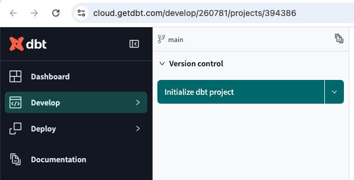
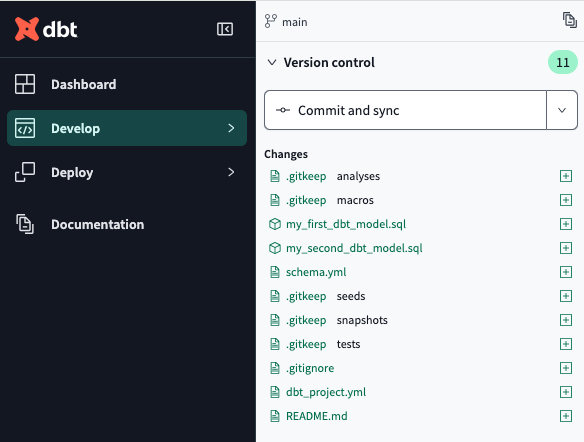
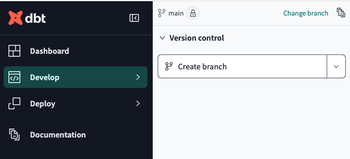
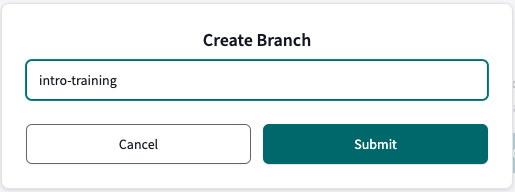

# Erste Schritte mit dbt Cloud

1. Klicke auf "Initialize dbt project" in der Versionskontrolle

   

2. Klicke auf "Commit and sync" in der Versionskontrolle und gib eine Commit-Nachricht in das Dialogfeld ein

   

3. Klicke auf "Create branch" in der Versionskontrolle und benenne es "intro-training"

   

   

4. Führe den folgenden Befehl in der Befehlszeile aus

   ```sh
   dbt run
   ```

   um alle Modelle in unserem Data Warehouse zu erstellen

5. Erstelle einen neuen Ordner "lego" im Verzeichnis "models" ("/models/lego")

6. Aktualisiere dbt_project.yml in den Zeilen 38–43, um alle Modelle im Verzeichnis "lego" standardmäßig als Tabellen zu materialisieren

   ```yaml
   models:
     my_new_project:
       # Applies to all files under models/example/
       example:
         +materialized: table

       lego:
         +materialized: table
   ```

7. Erstelle eine neue Datei im Verzeichnis "lego" namens "parts_per_set.sql" ("/models/lego/parts_per_set.sql") und füge den Inhalt aus "Original Lego Script.txt" ein

   ```sql
   WITH UNIQUE_PARTS AS (
   SELECT
       P.part_num
   FROM dbt_course.lego.parts as P
   INNER JOIN dbt_course.lego.inventory_parts as IP on P.part_num = IP.part_num
   INNER JOIN dbt_course.lego.inventories as I on I.id = IP.inventory_id
   INNER JOIN dbt_course.lego.sets as S on S.set_num = I.set_num
       GROUP BY P.part_num
       HAVING COUNT(*) = 1
   )
   SELECT
       T.name as theme_name,
       S.name as set_name,
       S.year as set_year,
       CASE
           WHEN UP.part_num IS NULL THEN 'Not Unique'
           ELSE 'Unique'
       END as unique_part,
       COUNT(P.part_num) as parts
   FROM dbt_course.lego.parts as P
   LEFT JOIN UNIQUE_PARTS as UP on P.part_num = UP.part_num
   INNER JOIN dbt_course.lego.inventory_parts as IP on P.part_num = IP.part_num
   INNER JOIN dbt_course.lego.inventories as I on I.id = IP.inventory_id
   INNER JOIN dbt_course.lego.sets as S on S.set_num = I.set_num
   INNER JOIN dbt_course.lego.themes as T on T.id = S.theme_id
   GROUP BY 1,2,3,4;
   ```

8. Führe den folgenden Befehl in der Befehlszeile aus

   ```sh
   dbt run --select parts_per_set
   ```

   um das Modell "parts_per_set" in unserem Data Warehouse zu erstellen

9. Entferne das Semikolon aus Zeile 26 in "models/lego/parts_per_set.sql"

   ```sql
   GROUP BY 1,2,3,4
   ```

   <details>
   <summary>Vollständiges SQL</summary>

   ```sql
   WITH UNIQUE_PARTS AS (
   SELECT
       P.part_num
   FROM dbt_course.lego.parts as P
   INNER JOIN dbt_course.lego.inventory_parts as IP on P.part_num = IP.part_num
   INNER JOIN dbt_course.lego.inventories as I on I.id = IP.inventory_id
   INNER JOIN dbt_course.lego.sets as S on S.set_num = I.set_num
       GROUP BY P.part_num
       HAVING COUNT(*) = 1
   )
   SELECT
       T.name as theme_name,
       S.name as set_name,
       S.year as set_year,
       CASE
           WHEN UP.part_num IS NULL THEN 'Not Unique'
           ELSE 'Unique'
       END as unique_part,
       COUNT(P.part_num) as parts
   FROM dbt_course.lego.parts as P
   LEFT JOIN UNIQUE_PARTS as UP on P.part_num = UP.part_num
   INNER JOIN dbt_course.lego.inventory_parts as IP on P.part_num = IP.part_num
   INNER JOIN dbt_course.lego.inventories as I on I.id = IP.inventory_id
   INNER JOIN dbt_course.lego.sets as S on S.set_num = I.set_num
   INNER JOIN dbt_course.lego.themes as T on T.id = S.theme_id
   GROUP BY 1,2,3,4
   ```

   </details>

10. Führe den folgenden Befehl in der Befehlszeile aus

    ```sh
    dbt run --select lego
    ```

    um alle Modelle im Verzeichnis "lego" in unserem Data Warehouse zu erstellen

11. Erstelle eine neue Datei im Verzeichnis "lego" namens "\_sources.yml" ("/models/lego/\_sources.yml"), um dbt zu zeigen, wo sich die Quelltabellen befinden

    ```yaml
    version: 2

    sources:
      - name: lego
        database: dbt_course
        schema: lego
        tables:
          - name: parts
          - name: inventory_parts
          - name: inventories
          - name: sets
          - name: themes
    ```

12. Bearbeite "parts_per_set.sql" und ersetze alle fest codierten Tabellennamen durch die source-Funktion

    ```sql
    WITH UNIQUE_PARTS AS (
    SELECT
        P.part_num
    FROM {{ source('lego', 'parts') }} as P
    INNER JOIN {{ source('lego', 'inventory_parts') }} as IP on P.part_num = IP.part_num
    INNER JOIN {{ source('lego', 'inventories') }} as I on I.id = IP.inventory_id
    INNER JOIN {{ source('lego', 'sets') }} as S on S.set_num = I.set_num
        GROUP BY P.part_num
        HAVING COUNT(*) = 1
    )
    SELECT
        T.name as theme_name,
        S.name as set_name,
        S.year as set_year,
        CASE
            WHEN UP.part_num IS NULL THEN 'Not Unique'
            ELSE 'Unique'
        END as unique_part,
        COUNT(P.part_num) as parts
    FROM {{ source('lego', 'parts') }} as P
    LEFT JOIN UNIQUE_PARTS as UP on P.part_num = UP.part_num
    INNER JOIN {{ source('lego', 'inventory_parts') }} as IP on P.part_num = IP.part_num
    INNER JOIN {{ source('lego', 'inventories') }} as I on I.id = IP.inventory_id
    INNER JOIN {{ source('lego', 'sets') }} as S on S.set_num = I.set_num
    INNER JOIN {{ source('lego', 'themes') }} as T on T.id = S.theme_id
    GROUP BY 1,2,3,4
    ```

13. Erstelle eine neue Datei im Verzeichnis "lego" namens "unique_parts.sql" ("/models/lego/unique_parts.sql")

14. Kopiere die Zeilen 2–9 aus "parts_per_set.sql" in "unique_parts.sql"

    ```sql
    SELECT
        P.part_num
    FROM {{ source('lego', 'parts') }} as P
    INNER JOIN {{ source('lego', 'inventory_parts') }} as IP on P.part_num = IP.part_num
    INNER JOIN {{ source('lego', 'inventories') }} as I on I.id = IP.inventory_id
    INNER JOIN {{ source('lego', 'sets') }} as S on S.set_num = I.set_num
        GROUP BY P.part_num
        HAVING COUNT(*) = 1
    ```

15. Füge einen config-Block am Anfang von "unique_parts.sql" ein, um es als View im Data Warehouse zu materialisieren

    ```sql
    {{
        config(
            materialized='view'
        )
    }}

    SELECT
        P.part_num
    FROM {{ source('lego', 'parts') }} as P
    INNER JOIN {{ source('lego', 'inventory_parts') }} as IP on P.part_num = IP.part_num
    INNER JOIN {{ source('lego', 'inventories') }} as I on I.id = IP.inventory_id
    INNER JOIN {{ source('lego', 'sets') }} as S on S.set_num = I.set_num
        GROUP BY P.part_num
        HAVING COUNT(*) = 1
    ```

16. Aktualisiere "parts_per_set.sql" und ersetze den CTE (Zeilen 1–10) mit einer ref()-Funktion, die auf "unique_parts.sql" verweist

    ```sql
    WITH UNIQUE_PARTS AS (
        SELECT *
        from {{ ref('unique_parts') }}
    )
    SELECT
        T.name as theme_name,
        S.name as set_name,
        S.year as set_year,
        CASE
            WHEN UP.part_num IS NULL THEN 'Not Unique'
            ELSE 'Unique'
        END as unique_part,
        COUNT(P.part_num) as parts
    FROM {{ source('lego', 'parts') }} as P
    LEFT JOIN UNIQUE_PARTS as UP on P.part_num = UP.part_num
    INNER JOIN {{ source('lego', 'inventory_parts') }} as IP on P.part_num = IP.part_num
    INNER JOIN {{ source('lego', 'inventories') }} as I on I.id = IP.inventory_id
    INNER JOIN {{ source('lego', 'sets') }} as S on S.set_num = I.set_num
    INNER JOIN {{ source('lego', 'themes') }} as T on T.id = S.theme_id
    GROUP BY 1,2,3,4
    ```

17. Führe den folgenden Befehl in der Befehlszeile aus

    ```sh
    dbt run --select lego
    ```

    um die beiden lego-Modelle nacheinander in unserem Data Warehouse zu erstellen

18. Erstelle eine neue Datei im Verzeichnis "lego" namens "\_schema.yml" ("/models/lego/\_schema.yml"), um Dokumentation und Tests hinzuzufügen

    ```yml
    version: 2

    models:
      - name: unique_parts
        description: The part_nums which are only used in one set
        columns:
          - name: part_num
            data_tests:
              - not_null

      - name: parts_per_set
        description: Shows the number of parts in each set along with their theme and whether they have unique parts
        columns:
          - name: theme_name
            data_tests:
              - not_null
          - name: set_name
            data_tests:
              - not_null
          - name: set_year
            data_tests:
              - not_null
    ```

19. Führe den folgenden Befehl in der Befehlszeile aus

    ```sh
    dbt build
    ```

    um alle Modelle in unserem Data Warehouse zu erstellen und zu testen

20. Führe den folgenden Befehl in der Befehlszeile aus

    ```sh
    dbt test
    ```

    um alle Modelle zu testen

21. Bearbeite die Datei "my_first_dbt_model.sql" im Verzeichnis "example" ("/models/example/my_first_dbt_model.sql") und entferne den Kommentar in Zeile 27

    ```sql

    /*
        Welcome to your first dbt model!
        Did you know that you can also configure models directly within SQL files?
        This will override configurations stated in dbt_project.yml

        Try changing "table" to "view" below
    */

    {{ config(materialized='table') }}

    with source_data as (

        select 1 as id
        union all
        select null as id

    )

    select *
    from source_data

    /*
        Uncomment the line below to remove records with null `id` values
    */

    where id is not null

    ```

22. Führe den folgenden Befehl in der Befehlszeile aus

    ```sh
    dbt build
    ```

    um alle Modelle in unserem Data Warehouse zu erstellen und zu testen. Alle sollten erfolgreich sein.

23. Aktualisiere die Datei "\_sources.yml" im Verzeichnis "lego" ("/models/lego/\_sources.yml") und ersetze sie mit der fertigen Version aus der Dateifreigabe

    ```yml
    version: 2

    sources:
      - name: lego
        database: DBT_COURSE
        schema: LEGO
        tables:
          - name: colors
            description: dimension table of lego colors
            columns:
              - name: id
                description: primary key and unique identifier of each color
                data_tests:
                  - not_null
                  - unique
              - name: name
                description: the name of the color
                data_tests:
                  - not_null
                  - unique
              - name: RGB
                description: the hex value of the color
                data_tests:
                  - not_null
              - name: is_trans
                data_tests:
                  - accepted_values:
                      arguments:
                        values: ["TRUE", "FALSE"]

          - name: inventories
            description: dimension table of what we currently stock
            columns:
              - name: id
                description: primary key
                data_tests:
                  - unique
                  - not_null
              - name: version
                description: the version of each set we carry
                data_tests:
                  - not_null
              - name: set_num
                description: foreign key and the set identifier
                data_tests:
                  - not_null
                  - relationships:
                      arguments:
                        to: source('lego','sets')
                        field: set_num

          - name: inventory_parts
            description: the parts within each set we stock
            columns:
              - name: inventory_id
                description: foreign key to inventories table
                data_tests:
                  - not_null
                  - relationships:
                      arguments:
                        to: source('lego','inventories')
                        field: id
              - name: part_num
                description: foreign key to parts table - not behaving properly
                data_tests:
                  - not_null
              - name: color_id
                description: foreign key to colors table
                data_tests:
                  - not_null
                  - relationships:
                      arguments:
                        to: source('lego','colors')
                        field: id
              - name: quantity
                description: how many of that part is in the set
                data_tests:
                  - not_null
              - name: is_spare
                description: boolean if the part is spare
                data_tests:
                  - not_null
                  - accepted_values:
                      arguments:
                        values: ["TRUE", "FALSE"]

          - name: inventory_sets
            description: dimension table of sets and how many we stock
            columns:
              - name: inventory_id
                description: foreign key to inventories
                data_tests:
                  - not_null
                  - relationships:
                      arguments:
                        to: source('lego','inventories')
                        field: id
              - name: set_num
                description: foreign key from sets
                data_tests:
                  - not_null
                  - relationships:
                      arguments:
                        to: source('lego','sets')
                        field: set_num
              - name: quantity
                description: how many of each set we hold

          - name: parts
            description: dimension table of lego parts
            columns:
              - name: part_num
                description: primary key and unique identifier of each part
                data_tests:
                  - not_null
                  - unique
              - name: name
                description: the name of the part
                data_tests:
                  - not_null
              - name: part_cat_id
                description: foreign key from part_categories table
                data_tests:
                  - not_null
                  - relationships:
                      arguments:
                        to: source('lego','part_categories')
                        field: id

          - name: part_categories
            description: dimension table combining parts into different categories
            columns:
              - name: id
                description: primary key
                data_tests:
                  - unique
                  - not_null
              - name: name
                description: the part category name
                data_tests:
                  - not_null

          - name: sets
            description: dimension table of all lego sets
            columns:
              - name: set_num
                description: primary key
                data_tests:
                  - not_null
                  - unique
              - name: name
                description: the name of the set
                data_tests:
                  - not_null
              - name: year
                description: the year the set was released
                data_tests:
                  - not_null
              - name: theme_id
                description: foreign key from themes
                data_tests:
                  - not_null
                  - relationships:
                      arguments:
                        to: source('lego','themes')
                        field: id
              - name: num_parts
                description: the number of parts in each set
                data_tests:
                  - not_null

          - name: themes
            description: dimension table grouping sets into different themes
            columns:
              - name: id
                description: primary key
                data_tests:
                  - not_null
                  - unique
              - name: name
                description: the name of the theme
                data_tests:
                  - not_null
              - name: parent_id
                description: if a theme is a sub-theme, the id of its parent
                data_tests:
                  - relationships:
                      arguments:
                        to: source('lego','themes')
                        field: id
    ```

    Diese endgültige Version hat umfassende Beschreibungen der Quellen und ihrer Spalten. Sie verwendet auch alle 4 integrierten data_tests (not_null, unique, accepted_values, relationships)

24. Führe den folgenden Befehl in der Befehlszeile aus

    ```sh
    dbt build
    ```

    um alle unsere Modelle nacheinander im Data Warehouse zu erstellen und zu testen

25. Führe den folgenden Befehl in der Befehlszeile aus

    ```sh
    dbt docs generate
    ```

    um Dokumentation basierend auf den Modellen und YAML-Dateien in unserem Projekt zu generieren

26. Klicke auf das kleine Dokumentsymbol, um die Dokumentation anzuzeigen

    

27. Klicke auf "Commit and sync" in der Versionskontrolle und gib eine Commit-Nachricht in das Dialogfeld ein

    

## [Zurück zum Inhaltsverzeichnis](readme.md)
